<h1 align="center">
  
</h1>

  

  

## 👋 About Me

I'm a backend-focused developer who enjoys turning ideas into reliable, maintainable systems.
My main focus is the <strong>Node.js ecosystem</strong>, especially <strong>TypeScript, NestJS, and Express</strong>, while I'm continuously expanding my knowledge of <strong>Go, Docker, and scalable system design</strong>.

I enjoy working on <strong>APIs, real-time applications, databases, and automation</strong> — 
and I learn best by building things, breaking them, and figuring out how to make them better.

  

---

## 🧰 Languages & Technologies

### 💻 Languages

  

  

### ⚙️ Backend

  

### 🗄️ Databases

  

### 🐳 DevOps & Tools

  

### 🤖 Automation & Testing

  
  

---

## 🚀 What I Like Building

<table align="center">
<tr>
<td align="center" width="180">

### 🌐

<b>APIs</b>

REST APIs
Backend Services
Authentication

</td>

<td align="center" width="180">

### ⚡

<b>Real-time</b>

WebSockets
Chat Applications
Live Systems

</td>

<td align="center" width="180">

### 🤖

<b>Automation</b>

Python
Playwright
Browser Automation

</td>

<td align="center" width="180">

### 🧩

<b>Architecture</b>

Clean Code
Scalability
Maintainability

</td>
</tr>
</table>

---

## 🌱 Currently Exploring

  

---

<picture>
  <source
    media="(prefers-color-scheme: dark)"
    srcset="./assets/overview.dark.svg"
  />
  
</picture>

<picture>
  <source
    media="(prefers-color-scheme: dark)"
    srcset="./assets/contributions.dark.svg"
  />
  
</picture>
---

  

  Build • Break • Learn • Repeat

